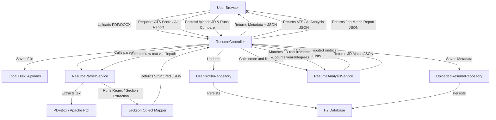

# Comprehensive Project Report: AI Resume Analyzer & Career Assistant

This report provides a detailed overview of the **AI Resume Analyzer & Career Assistant** project. It details the system architecture, analyzes the role of every single file, details the security mechanisms, and highlights the technical loopholes and failure vectors.

---

## 1. System Architecture & Data Flow

The application follows the classic **Model-View-Controller (MVC)** architectural pattern, built on **Spring Boot** (Java) for the backend and **vanilla HTML/CSS/JS** for the frontend, using a local **H2 Database** for persistence.

### The Live Data Flow
1. **User Interaction**: The user drops a file or selects it. The browser UI captures it and triggers an asynchronous `XMLHttpRequest` (AJAX).
2. **File Processing**: The server receives the file, checks the file type and size, and writes it to the local `uploads/` folder with a unique timestamped filename.
3. **Text Extraction**: The `ResumeParserService` reads the file bytes. Depending on the format, it uses Apache PDFBox (for PDFs) or Apache POI (for DOCX) to extract raw text.
4. **Offline Parsing**: The raw text is searched for contact details (email, phone, LinkedIn, GitHub, portfolio) using regular expressions. The text is then divided into sections (Skills, Experience, Education, Projects) based on heading keywords.
5. **Database Sync**: The parsed data is converted into structured JSON. The server automatically updates the default Guest User's `UserProfile` database record and saves the upload metadata in `UploadedResume`.
6. **AI Analysis**: The user triggers an AI report or job comparison. The `ResumeAnalysisService` reads the existing raw file text to calculate ATS scores, highlight missing skills, and provide custom linting feedback.
7. **UI Refresh**: The controller returns a success response. The browser frontend transitions views and renders the structured data or comparison report inside a clean, light-mode dashboard.

---

## 2. File-by-File Breakdown & Code Roles

Here is an analysis of every file in the codebase and its precise function:

### Build & Configurations

#### pom.xml
- **Role**: Maven configuration file. Defines project coordinates, compilation settings (Java 21), and manages external libraries.
- **Dependencies**:
  - `spring-boot-starter-web`: Pulls in Apache Tomcat (embedded server) and Spring MVC configurations.
  - `spring-boot-starter-data-jpa`: Pulls in Hibernate, entity management, and transaction controllers.
  - `h2`: Provides the lightweight, local in-memory/file-based SQL database engine.
  - `pdfbox`: Apache library loaded to parse and extract raw characters from PDF files.
  - `poi` & `poi-ooxml`: Apache libraries loaded to read structured XML packages inside Microsoft Word (`.docx`) files.

#### application.properties
- **Role**: Spring Boot application configuration.
- **Parameters**:
  - `server.port=8080`: Defines the port for the local server.
  - `spring.datasource.url=jdbc:h2:file:./resume_analyzer;...`: Configures H2 to write database states to a local file named `resume_analyzer.mv.db` in the current working directory, using MySQL syntax compatibility.
  - `spring.jpa.hibernate.ddl-auto=update`: Tells Hibernate to automatically modify database tables to match Java entity configurations on startup.
  - `spring.servlet.multipart.max-file-size=10MB`: Rejects any single file uploads larger than 10MB.
  - `spring.sql.init.schema-locations=classpath:schema.sql`: Tells Spring to run `schema.sql` on startup to initialize default databases and seed guest accounts.

#### schema.sql
- **Role**: Database initialization script. Runs at boot to create database tables (`users`, `user_profiles`, `uploaded_resumes`) and inject the default guest profile (`guest@career.com`) with `id = 1` so the app is instantly usable without a login wall.

---

### Database Models & Access Layer (JPA)

#### User.java
- **Role**: JPA Entity representing a record in the `users` table. Holds user credentials and access roles.

#### UserProfile.java
- **Role**: JPA Entity representing the active profile dashboard state. Stores standard contact strings and serializes complex data structures (like skills, experience list, education list, projects list) as JSON text dumps.

#### UploadedResume.java
- **Role**: JPA Entity representing metadata for uploaded files. Tracks filename, size, upload date, status (`PENDING`, `SUCCESS`, `FAILED`), and stores the raw parsed JSON content.
- **Hooks**: Contains a `@PrePersist` method that sets the current date and time when saving a record to the database.

#### UserRepository.java, UserProfileRepository.java, UploadedResumeRepository.java
- **Role**: Data access interfaces extending `JpaRepository`. They handle basic CRUD (Create, Read, Update, Delete) database transactions and implement helper methods like `findByUserId` without requiring manual SQL queries.

---

### Controllers & Services

#### ProfileController.java
- **Role**: RestController for the active profile state.
- **APIs**:
  - `GET /api/profile`: Fetches the guest user profile. If it doesn't exist, it creates a default "Guest User" profile.
  - `PUT /api/profile`: Receives a JSON profile payload and updates the database record.

#### ResumeController.java
- **Role**: RestController for document processing, analysis, and history.
- **APIs**:
  - `POST /api/resumes/upload`: Receives the multipart file payload, validates it, writes it to disk, calls the parser service, updates the active profile, and returns the upload record.
  - `GET /api/resumes/history`: Lists all uploaded resumes for the current user.
  - `GET /api/resumes/{id}`: Retrieves details for a specific upload, including the raw parsed JSON report.
  - `GET /api/resumes/{id}/ats`: Calculates and returns the ATS Score card metrics.
  - `GET /api/resumes/{id}/ai-analysis`: Evaluates structure, grammar, spelling, passive voice, weak sentences, tone, and readability.
  - `GET /api/resumes/{id}/suggestions`: Generates optimization suggestions for 10 resume sections.
  - `GET /api/resumes/{id}/skills-analysis`: Performs advanced skill classification, distributions, gaps, and strength levels.
  - `POST /api/resumes/{id}/match`: Performs comparison between the resume and a provided Job Description.
  - `DELETE /api/resumes/{id}`: Deletes the resume metadata from the database and removes the physical file from the local `uploads` directory.

#### ResumeParserService.java
- **Role**: The core parsing engine. Parses documents offline without calling third-party API hosts. Exposes a helper method to extract raw text content by filename for downstream scoring algorithms.
- **Mechanism**:
  - Checks if the file is PDF or Word.
  - Reads bytes and calls Apache PDFBox or POI.
  - Searches for email, phone, and social profile links using regular expressions.
  - Splits text into blocks based on section headers (e.g. `EDUCATION`, `SKILLS`, `EXPERIENCE`, `PROJECTS`).
  - Implements a fallback scanner that checks for common technical keywords (like Java, Python, Docker) if a resume lacks a dedicated skills section header.
  - Compiles the final data structures into a clean JSON string via Jackson's `ObjectMapper`.

#### ResumeAnalysisService.java
- **Role**: The core offline rules-based analysis and scoring engine.
- **Functions**:
  - Computes ATS, formatting, completeness, keywords, structure, and readability ratings.
  - Compares resumes to pasted/loaded job descriptions to output matching percentage, skill overlap, missing items, and experience/education alignments.
  - Checks for grammar issues, passive voice constructs, buzzwords, and casual tone.
  - Generates detailed formatting and section optimization suggestions (Resume Summary, Experience, Projects, Skills, Education, Certifications, Achievements, Action Verbs, Keyword Density, and Industry Specifics).
  - Performs advanced Skills Analysis (Categorizes detected skills, counts distributions, maps recommended skills, finds gaps, and calculates strength indicators).

---

### Frontend Files

#### index.html
- **Role**: Main HTML container. Set up as a single page dashboard with a sidebar menu, a top search bar, and distinct view panels (Dashboard, Resume History Table, Profile Forms, and Report Drawer Modal) toggled by JavaScript.

#### styles.css
- **Role**: Component stylesheet. Rewritten into a clean, starting-phase light theme with white background panels, dark text, clean gray borders, and simple transition animations.

#### app.js
- **Role**: Application client logic. Registers drag-and-drop file upload event listeners, manages upload progress bars via `XMLHttpRequest` progress triggers, handles tab switching, binds form values, and dynamically renders detailed parsing reports inside the modal overlay.

---

## 3. Security Measures & Defenses

Here is how the project currently protects itself and user data:

1. **100% Offline Processing (Data Privacy)**:
   - By eliminating external LLM APIs (like Gemini or OpenAI), the resume content never leaves the local machine. This protects personal details (phone numbers, addresses, emails) from being transmitted over the network or logged by third parties.
2. **Strict File Size Limits**:
   - Spring Boot configurations set the maximum file size to `10MB`. This prevents disk space exhaustion attacks (Denial of Service) where a malicious actor attempts to crash the host by uploading gigabytes of data.
3. **MIME-Type Whitelisting**:
   - The `ResumeController` explicitly verifies the file content type. Only `application/pdf`, `application/msword`, and `application/vnd.openxmlformats-officedocument.wordprocessingml.document` are accepted. This prevents attackers from uploading executable files (like `.exe` or `.jsp` shells) to the host system.
4. **Sanitized File Storage**:
   - Files are written to disk using a unique timestamp prefix (`System.currentTimeMillis() + "_" + originalFileName`). This prevents filename collisions (overwriting someone else's file) and blocks directory traversal attempts (e.g., files named `../../some_file`).
5. **SQL Injection Defense**:
   - The data access layer uses Spring Data JPA. Under the hood, JPA executes queries using parameterized statements (Prepared Statements), preventing SQL injection attacks.
6. **XSS Mitigation**:
   - The frontend JavaScript uses a custom `escapeHtml` function before inserting text into the DOM. This neutralizes HTML tags and JavaScript snippets embedded inside a resume, blocking Cross-Site Scripting (XSS) attacks.

---

## 4. Vulnerabilities, Loopholes, & How the System Can Break

This section analyzes the vulnerabilities, design limitations, and failure vectors of the project.

### 💀 Severe Security Vulnerabilities

#### A. Lack of Authentication & Authorization (Authentication Bypass)
- **The Issue**: The application bypasses authentication and defaults to `DEFAULT_USER_ID = 1L` for all operations.
- **Exploitation**: In a multi-user environment, any person accessing the application URL can view the guest profile, access the full upload history, delete saved files, and overwrite profile data. There is no user isolation.
- **Remediation**: Integrate Spring Security and configure OAuth2 or JWT-based authentication.

#### B. Plaintext Local Database Storage
- **The Issue**: H2 database writes data to the host's filesystem in plaintext (`resume_analyzer.mv.db`).
- **Exploitation**: If an attacker gains access to the host machine or backup storage, they can open the database file and read all extracted emails, phone numbers, and profile details directly.
- **Remediation**: Enable database-level encryption (H2 support AES encryption for file databases).

#### C. Path Traversal Risk (Partial Filename Trust)
- **The Issue**: The code uses `file.getOriginalFilename()` to construct the destination path:
  `Paths.get(UPLOAD_DIR, uniqueFileName)`
- **Exploitation**: Although Java's `Paths.get()` mitigates some directory traversals, if an attacker uploads a file named `../../etc/passwd` or similar and the OS handles it weakly, they might overwrite critical system files.
- **Remediation**: Sanitize the filename to strip any path traversal characters (such as `..` or `/`) before saving it:
  `String cleanFileName = new File(file.getOriginalFilename()).getName();`

---

### ⚠️ Functional Failures & Breakdowns (How it crashes)

#### A. Out of Memory (OOM) via Corrupted Files / Zip Bombs
- **The Issue**: Decompressing and extracting text from large Word documents (`.docx`) or complex PDF layouts can consume a significant amount of memory.
- **Exploitation**: An attacker can upload a compressed "zip bomb" (a tiny docx file that expands to gigabytes in memory when parsed by Apache POI). This causes the JVM to run out of memory and crashes the Spring Boot server.
- **Remediation**: Run parsing inside sandboxed threads with strict memory limits and execution timeouts.

#### B. Incomplete Parsing (OCR Deficit)
- **The Issue**: `ResumeParserService` relies on text strippers (PDFBox/POI). It cannot extract text from scanned images or PDF files where the text is saved as image paths rather than characters.
- **Exploitation**: Uploading a scanned PDF or a picture of a resume results in empty profile sections and a parsed score of 0, as the service does not include an OCR (Optical Recognition) engine.
- **Remediation**: Integrate Tesseract OCR or alert the user when zero characters are extracted.

#### C. Highly Rigid Regex / Section Dividers
- **The Issue**: Parsing relies on English header matches (e.g. `EDUCATION`, `SKILLS`).
- **Exploitation**: If a resume is written in another language (e.g. Spanish "Educación" or German "Erfahrung") or uses non-standard header names (e.g. "Where I studied"), the parser will fail to group sections correctly, populating the database with empty fields.
- **Remediation**: Use semantic matching or machine learning models instead of rigid regex.

#### D. Port Bind Collisions
- **The Issue**: Port `8080` is a generic development port.
- **Exploitation**: If another program (like Jenkins, Tomcat, or Docker) is already running on port 8080 when the server starts up, the Spring Boot application will fail to bind to the port and crash.
- **Remediation**: Use a custom port in `application.properties` or configure dynamic port allocation.
